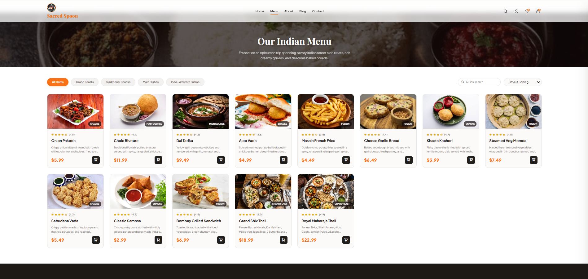
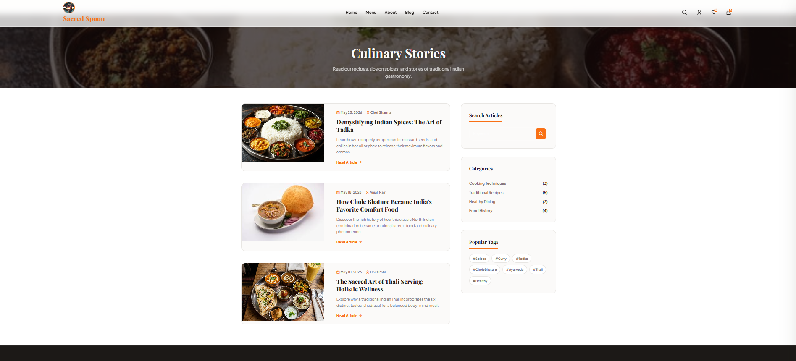

# 🍽️ PokeVedVS Restaurant Website

A modern and responsive restaurant website designed to provide customers with an engaging online dining experience.

---

## 📌 Features

- Responsive Design
- Interactive Navigation
- Restaurant Menu Showcase
- Modern User Interface
- Mobile-Friendly Layout
- Add to Cart Functionality
- Blog Section
- Contact Page

---

## 🛠️ Technologies Used

- HTML5
- CSS3
- JavaScript

---

## 🎯 Objective

To build a visually appealing restaurant website that enhances customer engagement and effectively showcases restaurant offerings, menu items, and services.

---

## 📸 Website Screenshots

### 🏠 Home Page


---

### ℹ️ About Us Page


---

### 🍕 Menu Page



---

### 🛒 Add to Cart Page


---

### 📰 Blog Page



---

### 📞 Contact Us Page


---

## 🚀 Future Enhancements

- Online Table Reservation System
- Food Ordering & Payment Gateway
- Customer Reviews & Ratings
- User Authentication
- Admin Dashboard
- Order Tracking System

---

## 📂 Project Structure

```text
PokeVedVS-Restaurant-Website/
│
├── index.html
├── css/
├── js/
├── images/
├── screenshots/
│   ├── home page.png
│   ├── about us.png
│   ├── menu.png
│   ├── add to cart.png
│   ├── blog.png
│   └── contact us.png
│
└── README.md
```

---

## 💡 Key Highlights

✔ Fully Responsive Design  
✔ User-Friendly Navigation  
✔ Modern Restaurant UI  
✔ Interactive Menu Display  
✔ Optimized for Desktop & Mobile Devices

---

## 👨‍💻 Author

**Vedant Mishra**

- GitHub: https://github.com/Vedant-Satish-Mishra
- LinkedIn: https://www.linkedin.com/in/vedant-mishra-1920aa328/

---

⭐ If you like this project, don't forget to star the repository!
